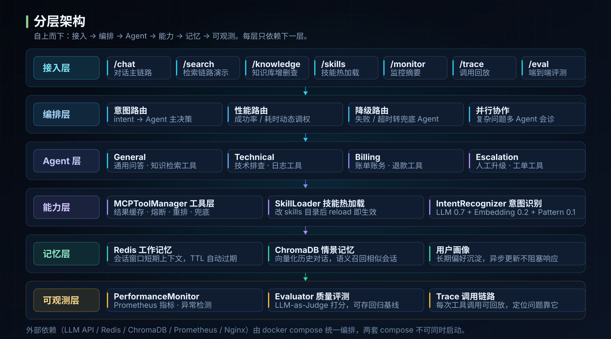
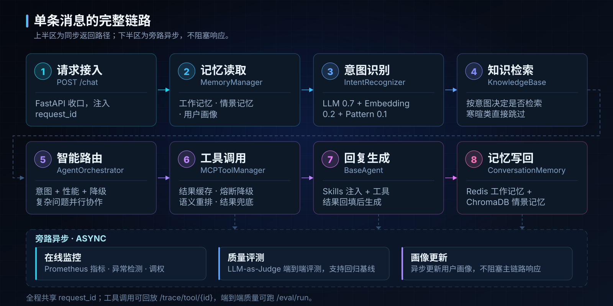
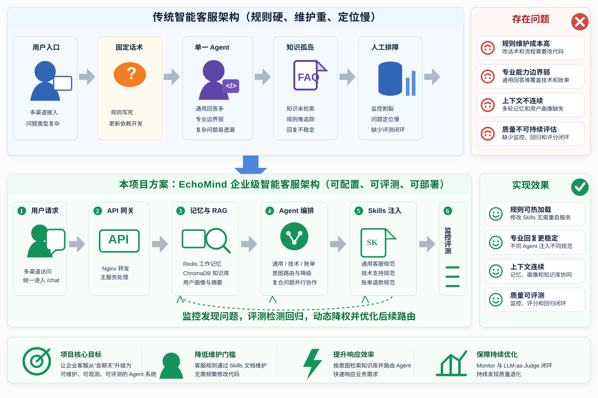
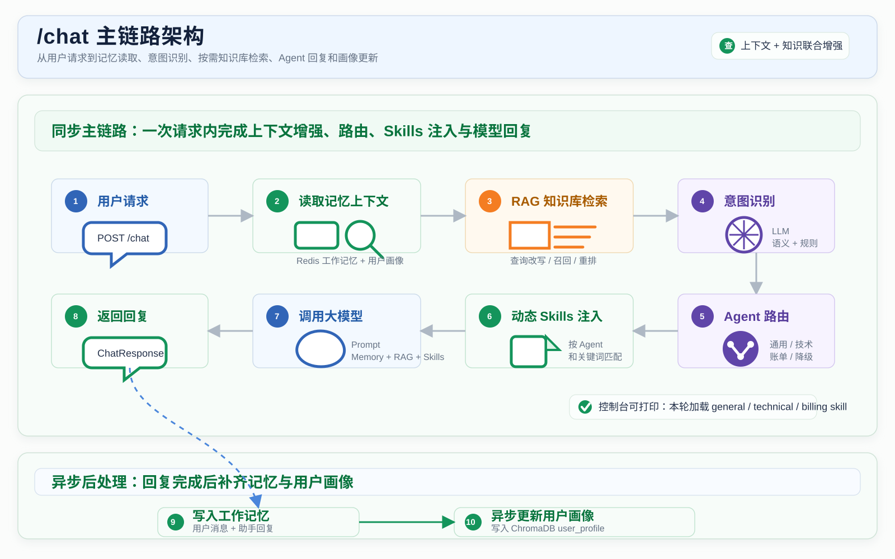
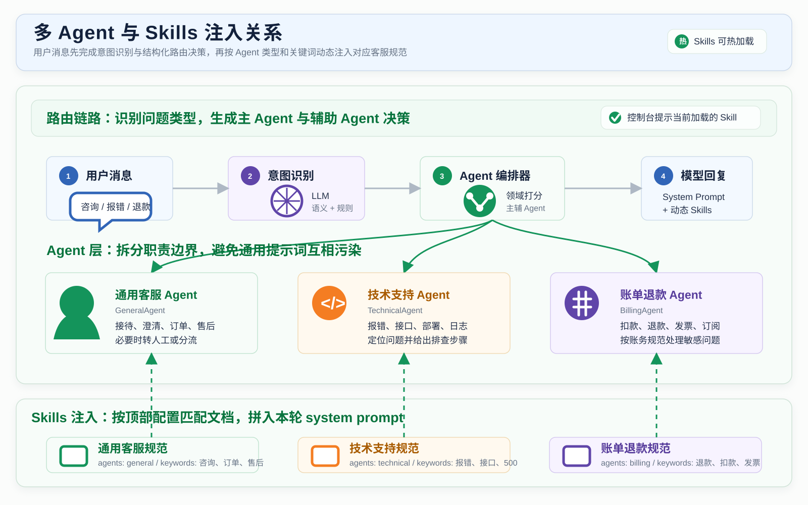
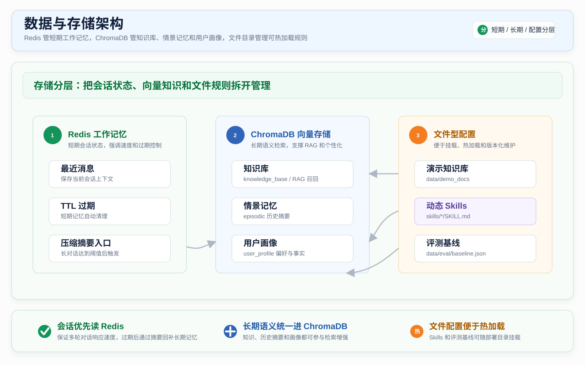
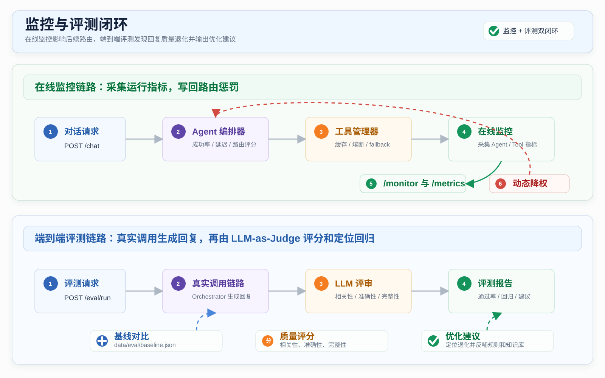
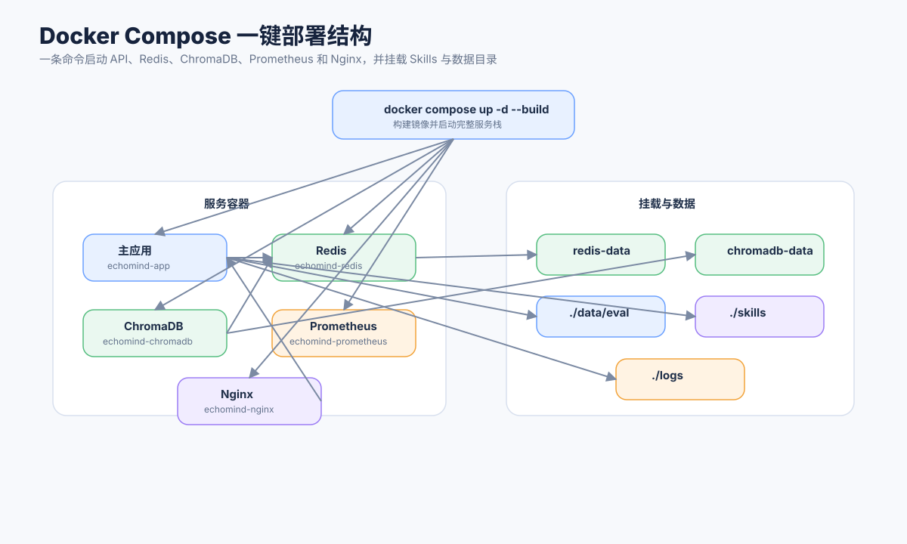

<div align="center">



<br>


<br><br>


</div>

---

一条用户消息进来，走完 **记忆读取 → 意图识别 → 知识检索（RAG）→ Agent 路由与协作 → 回复生成 → 记忆写回 → 监控采集** 的完整闭环。不是聊天机器人 Demo，而是一个**可观测、可评测、可降级**的多 Agent 运行时。

> 本仓库同时是一个**求职展示项目**：[`EchoMind求职项目学习指南.md`](EchoMind求职项目学习指南.md) 提供了按请求链路读代码的 7 天学习路径，以及面试时容易讲错的字段口径。

## 核心能力

| 能力 | 实现 | 代码位置 |
|---|---|---|
| 三路融合意图识别 | LLM 0.7 + Embedding 0.2 + Pattern 0.1，输出 intent / urgency / entities | `core/intent_recognizer.py` |
| 三级 Agent 路由 | 意图路由 + 性能路由（成功率/耗时）+ 降级路由，复杂问题多 Agent 并行会诊 | `agents/agent_orchestrator.py` |
| MCP 风格工具层 | 结果缓存 · 熔断 · 语义重排 · 兜底降级，每次调用可回放 | `mcp/tool_manager.py` |
| Skills 热加载 | 改 `skills/` 目录后调 `/skills/reload` 即生效，不重启进程 | `core/skill_loader.py` |
| 分层记忆 | Redis 工作记忆（TTL）+ ChromaDB 情景记忆（向量召回）+ 用户画像 | `memory/conversation_memory.py` |
| 可观测 | Prometheus 指标 + 异常检测 + 路由调权建议 | `monitor/performance_monitor.py` |
| 可评测 | LLM-as-Judge 端到端打分，支持回归基线对比 | `evaluation/evaluator.py` |
| 可降级 | LLM 失败、工具失败、超时均有明确兜底路径，不把异常抛给用户 | `mcp/tool_manager.py` / `core/llm_utils.py` |

## 分层架构

<div align="center">

</div>

自上而下 **接入 → 编排 → Agent → 能力 → 记忆 → 可观测**，每层只依赖下一层。

## 核心链路

<div align="center">

</div>

主要接口：`/chat`（对话）、`/search`（检索优化链路演示）、`/knowledge/add|upload|stats`（知识库）、`/skills` + `/skills/reload`（Skills 查看/热加载）、`/monitor`（监控摘要）、`/trace/tool/{id}`（工具调用回放）、`/eval/run`（端到端评测）。

## 快速开始

### 前置条件

- Docker + Docker Compose
- 一个 LLM API Key（Anthropic 官方，或 DeepSeek 等兼容 Anthropic 协议的第三方服务）

### 方式一：启动后端全家桶（API + Redis + ChromaDB + Prometheus + Nginx）

```bash
cd EchoMind
cp .env.example .env      # 编辑 .env，填入 ANTHROPIC_API_KEY
docker compose up -d --build
```

访问入口：

| 服务 | 地址 |
|---|---|
| API / Swagger | `http://localhost:8000`（文档 `/docs`） |
| Nginx 统一入口 | `http://localhost` |
| ChromaDB（宿主机） | `http://localhost:8001` |
| Prometheus | `http://localhost:9090` |
| Redis | `localhost:6379` |

### 方式二：启动前端 + 网关（前端界面 + 后端 + Redis + ChromaDB）

```bash
cd EchoMindFrontend
# 关键：compose 从当前目录 .env 或 shell 环境读取 ANTHROPIC_API_KEY
cp ../EchoMind/.env .env     # 或 export ANTHROPIC_API_KEY=sk-xxx
docker compose up -d --build
```

访问：`http://localhost`（网关入口）或 `http://localhost:5174`（前端容器）。

> ⚠️ **两种方式二选一，不能同时启动**：两套 compose 复用了相同的容器名（`echomind-redis`、`echomind-chromadb`）、网络名和宿主机端口（80/8000/8001）。

### 第三方模型服务配置（以 DeepSeek 为例）

```env
ANTHROPIC_BASE_URL=https://api.deepseek.com/anthropic
ANTHROPIC_MODEL=deepseek-v4-pro
ANTHROPIC_API_KEY=your_key
```

## 本地开发

### 后端（Python 3.12）

```bash
cd EchoMind
python -m venv .venv && source .venv/bin/activate   # Windows: .venv\Scripts\activate
pip install -r requirements-dev.txt
pytest tests/ -v          # 回归测试用假 LLM + 假 ChromaDB，不访问外部服务
```

- `test_knowledge_base.py` / `test_conversation_memory.py` 依赖 `chromadb` 顶层导入；本机未装时会自动跳过（Windows 上 `chroma-hnswlib` 无预编译 wheel，Docker 镜像内不受影响）。
- CLI 调试模式（需本机 Redis 和 API Key）：`python -m api.main --cli`

### 前端（Node 22）

```bash
cd EchoMindFrontend
npm install
npm run dev               # http://localhost:5173，/api 代理到 localhost:8000
# 后端端口不是 8000 时：API_PROXY_TARGET=http://localhost:9000 npm run dev
```

> 若 `npm install` 后 `npm run build` 报 `Cannot find module '@rollup/rollup-win32-x64-msvc'`，是 npm 漏装了 rollup 的平台原生包（`node_modules/@rollup/` 会是空的）。显式补装即可，版本号与本机 rollup 保持一致：
> ```bash
> npm install @rollup/rollup-win32-x64-msvc@<rollup 版本> --no-save
> ```

## 仓库结构

```
EchoMind-多Agent客服求职项目/
├── assets/                     # 本 README 使用的配图（深色主题）
├── EchoMind/                   # 后端：多 Agent 编排、意图识别、RAG、记忆、监控、评测
│   ├── api/main.py             #   FastAPI 入口，所有接口在此收口
│   ├── agents/                 #   Orchestrator + General/Technical/Billing/Escalation
│   ├── core/                   #   意图识别、LLM 工具、Skills 加载
│   ├── mcp/                    #   知识库 + 工具管理器（缓存/熔断/重排/降级）
│   ├── memory/                 #   分层记忆（Redis + ChromaDB + 画像）
│   ├── monitor/                #   性能监控 + Prometheus + 异常检测
│   ├── evaluation/             #   LLM-as-Judge 评测
│   ├── skills/                 #   可被热加载的技能包
│   ├── tests/                  #   23 passed / 2 skipped
│   └── wiki/                   #   全套技术文档 + 架构图
├── EchoMindFrontend/           # 前端：Vue 3 + Vite 调试界面（4 个源文件）
│   └── src/                    #   App.vue / lib/api.js / styles.css / main.js
├── 文档+简历/                   # wiki 的可分发副本 + SVG 架构图/海报（求职材料）
└── EchoMind求职项目学习指南.md   # 7 天读码路径 + 简历写法
```

| 目录 | 内容 | 定位 |
|---|---|---|
| `EchoMind/` | Python/FastAPI 后端 | 核心实现 |
| `EchoMindFrontend/` | Vue 3 + Vite 调试界面：聊天、知识库管理、Skills 热加载、评测、Trace 查看 | 演示界面 |
| `文档+简历/` | `EchoMind/wiki/` 的可分发副本 + SVG 架构图/海报 | 求职材料，不替代代码 |
| `EchoMind求职项目学习指南.md` | 面向求职者的代码学习路径与简历写法指南 | 学习入口 |

## 文档导航

| 文档 | 内容 |
|---|---|
| [`EchoMind/README.md`](EchoMind/README.md) | 后端详解：架构、接口、运行时组件 |
| [`EchoMindFrontend/README.md`](EchoMindFrontend/README.md) | 前端详解：三种部署模式下 `/api` 的指向 |
| [`EchoMind/wiki/技术亮点.md`](EchoMind/wiki/技术亮点.md) | 面试讲法：关键技术点 |
| [`EchoMind/wiki/重点代码.md`](EchoMind/wiki/重点代码.md) | 逐模块代码导读 |
| [`EchoMind/wiki/业务流程说明.md`](EchoMind/wiki/业务流程说明.md) | 业务视角的流程说明 |
| [`EchoMind/wiki/完整使用指南.md`](EchoMind/wiki/完整使用指南.md) | 全功能操作手册 |
| [`EchoMind/2026.08.29改动说明.md`](EchoMind/2026.08.29改动说明.md) | 多 Agent 编排重构记录 |
| [`EchoMind求职项目学习指南.md`](EchoMind求职项目学习指南.md) | 7 天学习路径 + 简历写法 |

<details>
<summary><b>架构图集（6 张，展开查看）</b></summary>

<br>

| 整体架构 | 对话链路 |
|---|---|
|  |  |

| Agent 与 Skills | 数据存储 |
|---|---|
|  |  |

| 监控与评测 | 部署拓扑 |
|---|---|
|  |  |

</details>

## 注意事项（跨机移植）

- **整个目录是一个统一的 git 仓库**（2026-09-28 起）。原先 `EchoMind/` 与 `EchoMindFrontend/` 各自独立的仓库已合并，`README.md`、`EchoMind求职项目学习指南.md`、`文档+简历/` 现在都在同一个版本库内。当前无 remote，要推送执行 `git remote add origin <你的仓库地址>`。
- **历史备份**：子仓库合并前的 `.git` 备份在 `D:/git_repository/_EchoMind_subgit_backup_20260928/`；再早的原作者提交历史备份在 `D:/git_repository/_EchoMind_git_backup_20260927/`。确认无用后可删。
- **本机环境需重建**：`node_modules`、`dist`、`.idea`、`.venv` 等环境/产物文件已清理，未纳入版本库。按上文「本地开发」重建即可（`npm install` / `pip install -r requirements-dev.txt`）。原作者的 macOS 残留环境（`darwin-arm64` 版 `node_modules`、`.DS_Store`）已于 2026-09-27 清理。
- **已知限制**：管理接口无鉴权；Redis 默认密码 `echomind123` 为演示值，公网部署请修改 `.env` 中的 `REDIS_PASSWORD`；`chromadb` 在 Windows 上无预编译 wheel（Docker 内不受影响）；两套 compose 不可同时启动。
- `.env` 已被 gitignore 忽略，密钥不会进入版本库；请勿将真实 Key 提交到任何公开仓库。

---

<div align="center">

**EchoMind** — 可观测、可评测、可降级的多 Agent 客服运行时。

</div>
